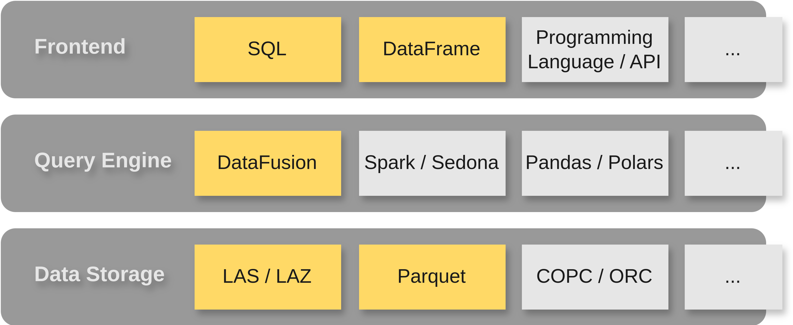

# Code Publication for "Point Cloud Data Management for Analytics in a Lakehouse"

This repository contains a demonstrative implementation for managing point cloud data in a lakehouse. The details of the approach are explained in the paper published in AGILE 2025, the code is supplementary material to this publication. When using the code or the ideas therein, please cite the AGILE publication (see Citation).



<!--  -->

## Repository Outline

The code is organized in several modules:

| Module      | Description |
| :---------- | :---------- |
| `pc-cli`    | Command line interface to process point cloud data.
| `pc-format` | Contains the internal data representation based on Arrow including indexing and partitioning structures. |
| `pc-io`     | Contains helper functions to read LAS and LAZ files. |

Additionally visualizations and evaluation scripts are in [assets](./assets/) respectively [scripts](./scripts/).

## Requirements

- Rust
- Python >=3.10
- PDAL (optional)
- PotreeConverter 2.0 (optional)

## Prepare Data

The Netherlands published a large point cloud known as Actueel Hoogtebestand Nederland (AHN) which you can start from when exploring this repository. It is a huge pointcloud which is served as a collection of LAZ files. To download a first example file from the third version, you can use the `ahn.py` script (requires Python >= 3.10).

```bash
# download extract of about 200M points from AHN4 (1 file)
python scripts/ahn.py --dataset AHN4 --filenames C_69AZ1
```

This will download the file `C_69AZ1.LAZ` into the `./data/AHN4` folder.

```sh
# download extract of about 2B points form AHN3 around Delft (4 files)
python scripts/ahn.py --dataset AHN3 --filenames C_37EN1 C_37EN2 C_37EZ1 C_37EZ2
```

## Experiments

Some experiments presented in the paper can be run through the command line.

### Storage Footprint

To evaluate the storage footprint, convert a LAZ file with various configurations:

```sh
# grid rounded coordinates, uncompressed
cargo run --release -- convert -i ./data/AHN4/C_69AZ1.LAZ -o ./data/AHN4/C_69AZ1_i32.parquet --raw
# resolved coordinates, uncompressed
cargo run --release -- convert -i ./data/AHN4/C_69AZ1.LAZ -o ./data/AHN4/C_69AZ1.parquet
# resolved coordinates, uncompressed, with importance
cargo run --release -- convert -i ./data/AHN4/C_69AZ1.LAZ -o ./data/AHN4/C_69AZ1_importance.parquet --importance
# grid rounded coordinates, zstd compression
cargo run --release -- convert -i ./data/AHN4/C_69AZ1.LAZ -o ./data/AHN4/C_69AZ1_zstd_i32.parquet --compression 'zstd(3)' --raw
# resolved coordinates, zstd compression
cargo run --release -- convert -i ./data/AHN4/C_69AZ1.LAZ -o ./data/AHN4/C_69AZ1_zstd.parquet --compression 'zstd(3)'
# resolved coordinates, zstd compression, with importance
cargo run --release -- convert -i ./data/AHN4/C_69AZ1.LAZ -o ./data/AHN4/C_69AZ1_zstd_importance.parquet --compression 'zstd(3)' --importance
```

The storage amplification is calculated by `converted` / `laz` file sizes.

For comparison with LAS you may use `pdal translate ./data/AHN4/C_69AZ1.LAZ ./data/AHN4/C_69AZ1.LAS`.

For comparison with Potree you may use `PotreeConverter(.exe) ./data/AHN4/C_69AZ1.LAZ -o ./data/AHN4/C_69AZ1_potree`.

### Partitioning and Query Execution

Partitioning and query execution is in the `partition` example and can be run with:

```sh
cargo run -p pc-cli --example partition --release
```

### Visualization Workload

Vizualization workload is in the `viz` example and can be run with:

```sh
cargo run -p pc-cli --example viz --release
```

## Evaluation

Appart from the outputs in the console, an evaluation script is provided: [../scripts/evaluation.py](../scripts/evaluation.py)


## Citation

```bibtex
@article{teuscher2025pointlakehouse,
  title={Point Cloud Data Management for Analytics in a Lakehouse},
  author={Teuscher, Balthasar and Werner, Martin},
  journal={AGILE: GIScience Series},
  year={2025},
}
```

## License

Licensed under Apache-2.0 license ([LICENSE](LICENSE) or https://opensource.org/licenses/Apache-2.0)
